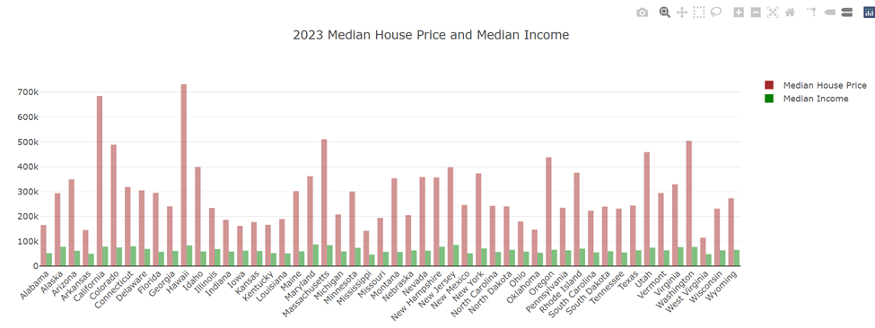
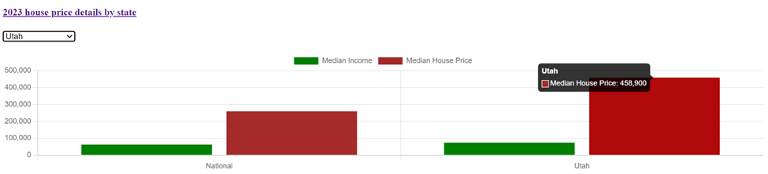
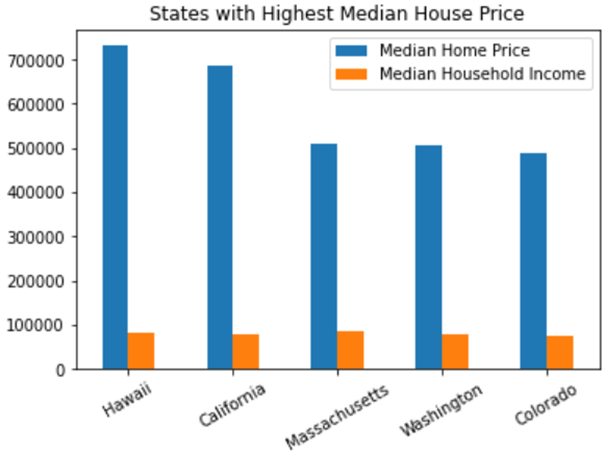
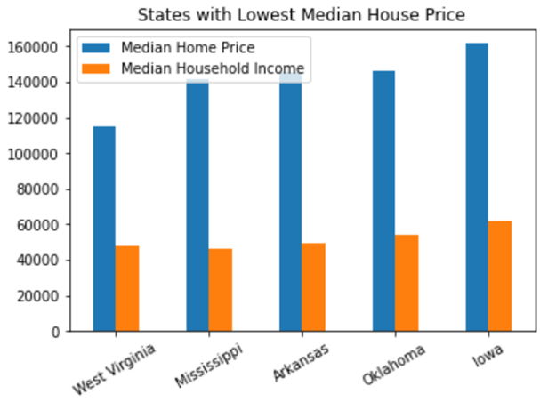

# Project-3

### Analysis of Median House Price data across the 50 states in USA:

- app.py is executed to create the following graphs. Reading the data from sqlite database and sending it to Flask API are handled in this python file.

- index.html - This html file is used to display the charts. It includes references to d3.js, Plotly.js, chart.js along with the reference to static.css file and script.js file.

- styles.css has few stying for the charts.

- script.js - This JavaScript file has the code for processing the data and generating the following 3 charts:

#### 2023 Median house price and median Income

When "Overview of 2023 house price" link is clicked, the following chart will be displayed.

Hawaii tops the list at $732,000, followed by California at $684,800. West Viginia is at the bottom of the list with median house price at $114,600.

#### Comparison of National medians with that of selected state

When "2023 house price details by state" link is clicked, a dropdown with the list of states will be shown along with the following charts. Based on the selected state, the chart will be updated dynamically.

  

* The median house price in Utah is $458,900. The National median house price is $259,350. 

* The median household income in Utah is $74,197. The National median household income is $62,529. 

* The median house size in Utah is 2,522 square feet. The national median is 1,913.5 square feet.

#### States with Highest and Lowest Median house price

analysis.ipynb - has the data analysis regarding the states with highest and lowest median house price.

        
